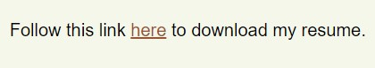
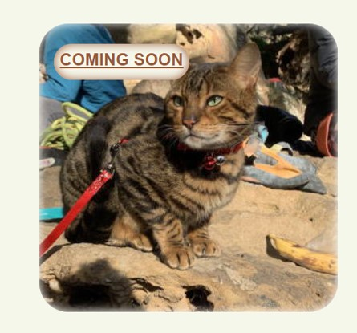

# portfolio

# My Portfolio
---

## Description

This is the beginning of the work on my professional portfolio. My motivation was to provide a point of reference for future employers in which they can review my work from one area, from this central point they can then be directed to other works of mine. 

It solves the problem of not having a professional portfolio.

I learnt a lot, as I began to wrap my head around Flexbox, margins and different sized screen needs. 

I feel I still have a lot to learn and this portfolio will be a continual work in progress. I had a design/look/feel in mind at the beginning, but upon completion I'm not happy with. So at a later date I will be coming back to this to rework the look and feel of the deployed site.

Let it be noted that 4 out 5 project links lead to my home Github page and are titled coming soon. These will be updated as I work on more sites and apps. For now there are place holder images of various animals I have met at the crag - hopefully they provide people with a bit of an "Awww" moment to distract from the lack of work at this stage. 

---

## Table of Contents (Optional)

If your README is long, add a table of contents to make it easy for users to find what they need.

- [Installation](#installation)
- [Usage](#usage)
- [Credits & Resources](#credits & resources)
- [License](#license)

---

## Installation

There are no specific steps required to launch my portfolio as this stage. 

Will work fine on all browsers and (hopefully) most screen sizes. 

*There is a margin glitch at the smallest size which I am still to resolve*

---

## Usage

I implemented a couple of new things and a couple of done before things. My images/examples will work from page top to bottom:

When you click on the navigation links you are taken to the relevant page placement.

When the user hovers over any of the project cards the card will have a inset glow of white. When the user further hovers over the project title link this will glow inset with one of the page theme colours.

Each contact information has an action built in. If the user wants to email me they can simply click on the email address and they will be taken to their relevant mail server. 
For phone a phone box will appear.
The GitHub link takes the user to my GitHub homepage.

To view my deployed portfolio visit the link below:

[ https://rosemaryjf.github.io/portfolio/]( https://rosemaryjf.github.io/portfolio/)

---

## Credits & Resources

I used the following sites to help inform/educate myself about how to do various aspects of my portfolio. This list is not extensive but covers the main ones used.

* [https://www.elegantthemes.com/blog/wordpress/call-link-html-phone-number](https://www.elegantthemes.com/blog/wordpress/call-link-html-phone-number)
* [https://www.freecodecamp.org/news/how-to-use-html-to-open-link-in-new-tab/](https://www.freecodecamp.org/news/how-to-use-html-to-open-link-in-new-tab/)
* [https://developer.mozilla.org/en-US/docs/Web/CSS/background-image](https://developer.mozilla.org/en-US/docs/Web/CSS/background-image)
* [https://www.w3schools.com/howto/howto_css_hero_image.asp](https://www.w3schools.com/howto/howto_css_hero_image.asp)
* [https://www.w3schools.com/cssref/css3_pr_background.asp](https://www.w3schools.com/cssref/css3_pr_background.asp)

The below link is what I used to decide my page colour theme:

* [https://coolors.co/](https://coolors.co/)

--- 

## License

I went with a simple MIT license for my portfolio. It can be found at my GitHub Repo. You can also access the lincense via the link below:

* [https://github.com/RosemaryJF/portfolio/blob/main/assets/LICENSE](https://github.com/RosemaryJF/portfolio/blob/main/assets/LICENSE)

---

## Resolved Issues

The main issue I ran into in the development of my portfolio was the placement for the image of myself. The code I was trying to use can be found pasted below:

    aside img {
      float: left;
      width: 25%;
      object-fit: inline;
    }

I originally had it placed in my about me but changed my mind to include in my header. I renamed the element in my HTML, gave header box a relative position and used the below code to place it where I wanted:

    header .container  {
      position: absolute;
      left: 90%;
      top: 2%;
      margin: 0 -17%;
    }

This code requires further work as to make the image work on multiple screens. I had to choose a placement that worked for them all rather than it changing dynamically as required.